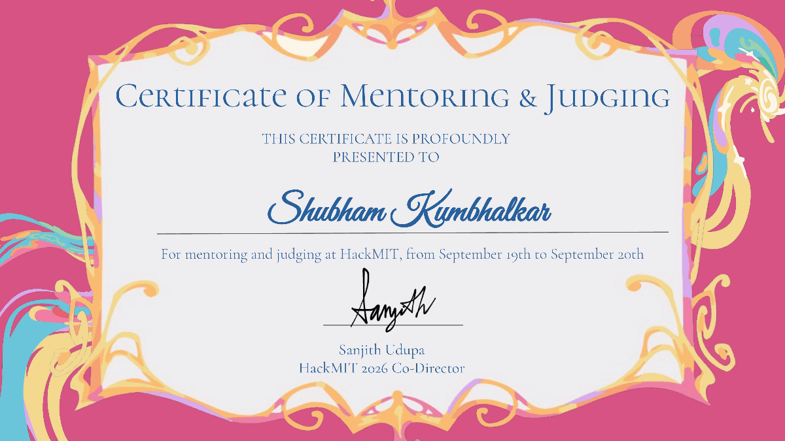
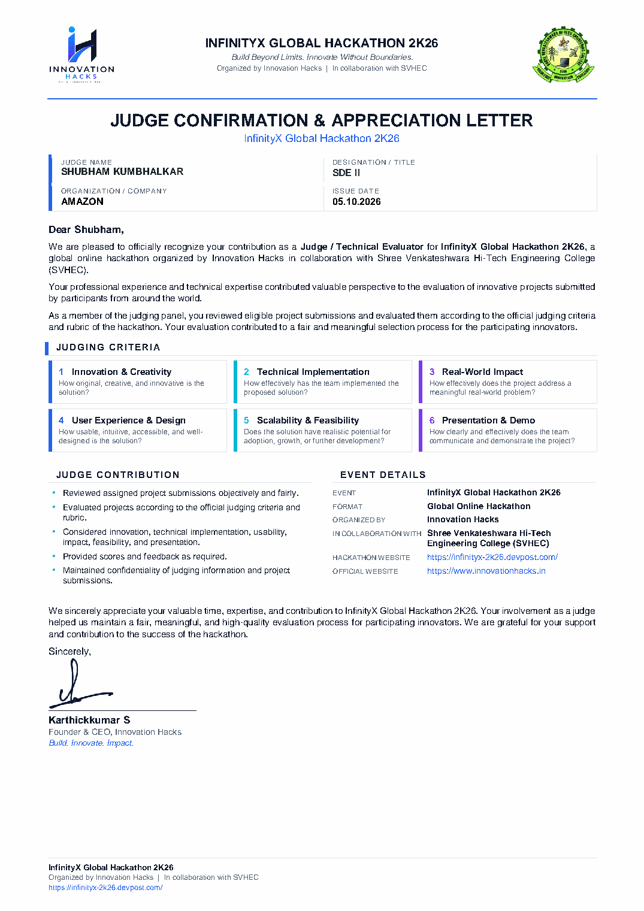

# Hi, I'm Shubham Kumbhalkar 👋

### Software Development Engineer II @ Amazon · Distributed systems at scale

I design and build large-scale distributed systems and cloud-native platforms, the kind that stay up and stay fast while the business grows underneath them. Over 10+ years I have taken ambiguous, high-stakes problems and turned them into reliable production software across **Java, Python, Rust, and AWS**, in domains spanning retail, fintech, and applied GenAI.

I care about three things: systems that scale, code that other engineers can trust, and giving back to the engineering community that got me here.

---

### 🔧 What I work with
`Java` · `Python` · `Rust` · `AWS (Lambda · EKS · S3 · CDK)` · `Spring Boot` · `Microservices` · `Kafka` · `DynamoDB` · `Docker` · `GenAI / LLM`

### 🚀 Impact I'm proud of
- Engineered a high-throughput system handling **500K+ requests/sec** across 5 external APIs, lifting SLA adherence by **22%**
- Led a **zero-downtime Tier-1 migration**, moving **15+ services** onto versioned infrastructure at **99.99% availability**
- Built a serverless anomaly-detection pipeline (Lambda + CloudTrail) that cut **mean-time-to-detect by 65%**
- Shipped a multi-unit ordering platform that reduced merchant costs by **40%**
- Delivered **GenAI/NLP** document-processing pipelines and an internal AI assistant that put on-call knowledge a question away

---

### ⚖️ Judging & technical evaluation
I regularly serve as a **judge and technical evaluator** for hackathons and startup pitch competitions, scoring projects against formal rubrics (innovation, technical implementation, real-world impact, scalability, and presentation) and giving builders feedback they can actually use.

| Event | Role | Scale |
|---|---|---|
| **[HackMIT 2026](certificates/HackMIT-2026-Certificate-and-Letter.pdf)** @ Massachusetts Institute of Technology | Mentor & Judge | 1,000+ students from 200+ colleges |
| **[InfinityX Global Hackathon 2K26](certificates/InfinityX-Judge-Confirmation.pdf)** (Innovation Hacks × SVHEC) | Judge / Technical Evaluator | Global, online |
| **Frontier Cascadia** @ UW Foster School of Business | In-person judge | 50+ teams, 200+ students, 12-judge panel |
| **USAII Global AI Hackathon 2026** | Core judge | 90+ countries |
| **AI Demo Day 4 · TechCommons Hacks V2 · Vibe Pitch 8 · Vibe Awards · OJ Ventures** | Judge / pitch-panel | Startup & demo-day pitches |

  
  

Signed credentials, click to open: HackMIT 2026 Certificate of Mentoring & Judging (MIT) and the InfinityX Global Hackathon 2K26 Judge Confirmation & Appreciation Letter.

---

### 📄 Research & writing
- **SSRN (2026)** — [*Faster, Fairer, Cheaper: The AI Revolution in US Consumer Lending*](https://papers.ssrn.com/sol3/papers.cfm?abstract_id=6948938)
- **IJRET** — *Wireless Audio Switching and Transmission System for Public Address*
- I write about distributed systems, cloud, and AI engineering on [Medium](https://medium.com/@shubham.kumbhalkar) and [The Nuclear Geeks](https://thenucleargeeks.com/author/shubhamkumbhalkar/)
- [Google Scholar](https://scholar.google.com/citations?user=XXWruvEAAAAJ) · [ORCID](https://orcid.org/0009-0008-3700-3594)

### 🏆 Recognition
National competition awards — **Explore 5.0** (2nd) · **ZHEP14 / Project Loon** (1st) · **TECHNOPATI** (2nd)

---

### 🌐 Portfolio & links
**[shubhamkumbhalkar.github.io](https://shubhamkumbhalkar.github.io)**

